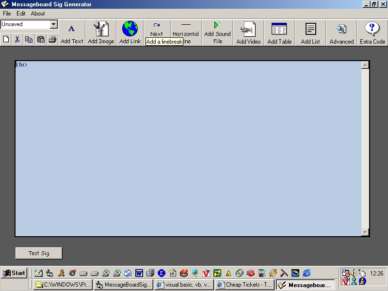



## Messageboard Sig Generator \(NOW Fully Commented\)

### Description

This is my comercial program!! i have been working on this for the last 6 months. The program involves many in depth wizards which the user can choose from, then the program outputs the HTML code which the user needs for their sig. You can then test the signiture in an ezboard enviroment which the program does for you. Gives the HTML code in the wizards for Text, Images, Links, Sound Files, Video Files, Tables, Lists. Their are also built in adavanced javascripts. PLEASE VOTE, this has taken me a long time.
 
### More Info
 

             |
---                |---
**Submitted On**   |2002-09-11 17:26:10
**By**             |[Mike Howell](https://github.com/Planet-Source-Code/PSCIndex/blob/master/ByAuthor/mike-howell.md)
**Level**          |Intermediate
**User Rating**    |4.7 (71 globes from 15 users)
**Compatibility**  |VB 5\.0, VB 6\.0
**Category**       |[Complete Applications](https://github.com/Planet-Source-Code/PSCIndex/blob/master/ByCategory/complete-applications__1-27.md)
**World**          |[Visual Basic](https://github.com/Planet-Source-Code/PSCIndex/blob/master/ByWorld/visual-basic.md)
**Archive File**   |[Messageboa1303529122002\.zip](https://github.com/Planet-Source-Code/mike-howell-messageboard-sig-generator-now-fully-commented__1-38745/archive/master.zip)

### API Declarations

LOTS

